# ReclibWH - A home for Recommender Systems

I started this project looking to implement a simple recommender system
to help me choose films for movie nights. It has since turned into a long-term project to learn more about the many innovative and insightful ML techniques powering modern recommenders. 

## Usage

```
pip install .
```

Import your recommender of choice
```
from reclibwh.recommender.recommenderMF import RecommenderMF
```

Instantiate data object (uses the movielens data downloadable from here https://grouplens.org/datasets/movielens/100k/)
```
data_folder = './data/ml-latest-small'
from reclibwh.utils.ItemMetadata import ExplicitDataFromCSV
d = ExplicitDataFromCSV(True, data_folder=data_folder)
```

Instantiate model
```
save_path = './models/MyMatrixFactorizer'
rmf = RecommenderMF(
    mode='train', n_users=d.N, n_items=d.M,
    mf_kwargs={
        'f':20, 'lamb':0 , 'decay':0.9, 'lr':0.005, 'epochs': 20, 'batchsize': 50,
        'normalize': {'loc':0., 'scale':5.0}, 'adaptive_reg': True, 'Nranked': d.Nranked
    },
    model_path=save_path
)
```

Input data, train and save
```
rmf.input_data(d)
rmf.train()
rmf,save(save_path)
```

## Brief overview

Below is a brief overview of what is currently implemented. The techniques implemented fall broadly into 3 categories:

- Nearest-neightbour methods
- Matrix Factorization techniques
- Bayesian Methods
  
These are by no means mutually exclusive (for instance there are Bayesian Matrix Factorization methods), I merely prioritize categorization based on the way assumptions are made. NN methods and Matrix Factorization techniques tend to rely more on informal heuristics for modelling, whereas Bayesian methods take a more 'probabilistic' approach, relying mostly on graphical models to make explicit the assumptions. 

### **Nearest-Neighbor Collaborative Filtering**
These models use item-item NN methods, based on a vector of user ratings (explicit/implicit).They are simple to implement and interpret, and work well with little data. They are however, rather inefficient (O(UI)) to compute, and they do not involve any learning, making them less powerful than ML-based methods.

- [x] cosine distance model (implemented as:  `reclibwh.recommender.recommenderCFSimple`)
- [x] TF-IDF + cosine model (implemented as:  `reclibwh.recommender.recommenderCFSimple`)
- [ ] BM25 + cosine model

### **Matrix Factorization Techniques**
These methods try to approximately factorize the user-item matrix `U`, into a set of low-rank factor matrices `P` and `Q`. With `K<<M` and `K<<N`.

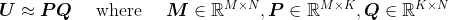


There are matrix factorization methods that deal with both explicit and implicit data. The loss function to optimize to predict the resulting matrix can be designed to reflect these assumptions.

- [x] Explicit (SVD-like factorization)
- [x] Explicit (Factorization plus bias) (implemented as `reclibwh.recommender.recommenderMF`)
- [x] Implicit (Alternating Least-Squares: http://yifanhu.net/PUB/cf.pdf) (implemented as `reclibwh.recommender.recommenderALS`)
- [x] Implicit (Logistic Matrix Factorization: https://web.stanford.edu/~rezab/nips2014workshop/submits/logmat.pdf) ((implemented as `reclibwh.recommender.recommenderLMF`))
- [ ] Implicit (Bayesian Personalized Ranking: https://arxiv.org/pdf/1205.2618.pdf)

### **Bayesian Methods**

Methods here usually frames the problem as a probabilistic graphical model (PGM), to more precisely model the assumptions of the recommendation system. For instance, the Collaborative Topic Modelling is modelled by the graphical model below (user item factors `u`, `v`, document and word topics `\theta`, `w`). More 'established' methods are usually used (Variational methods, EM, MCMC integration, occasionally SGD).

<div style="text-align:center">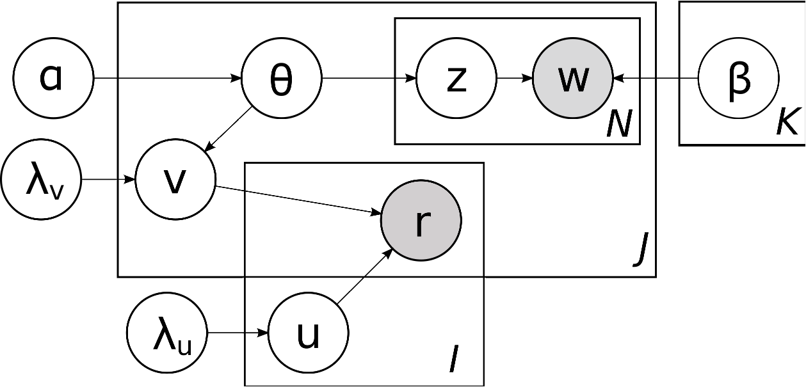</div>

- [x] Probabilistic Matrix Factorization https://papers.nips.cc/paper/3208-probabilistic-matrix-factorization.pdf (adaptive regularzition implemented as `reclibwh.core.AdaptiveRegularizer`)
- [ ] Bayesian MF with MCMC https://dl.acm.org/doi/pdf/10.1145/1390156.1390267
- [ ] Rating LDA : https://www.researchgate.net/publication/305415848_Rating_LDA_Model_for_Collaborative_Filtering
- [ ] pLSA for Collaborative Filtering https://dl.acm.org/doi/10.1145/963770.963774
- [ ] Collaborative Topic Modelling http://www.cs.columbia.edu/~blei/papers/WangBlei2011.pdf

## Some highlights

### **Adaptive regularization via Probabilistic Matrix Factorization**

Matrix factorization methods involve breaking the user-item *utility* matrix `U` into a matrix of user factors `P` and item factors `Q`. A common regularized form of the loss function for explcit matrix factorization is (`R_ij` is the measure rating and `I_ij` is the indicator function for if `R_ij` exists):

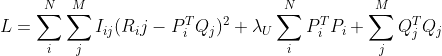

[https://papers.nips.cc/paper/3208-probabilistic-matrix-factorization.pdf] Gives an elegant probabilistic model for the matrix factorization:

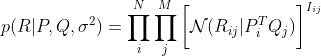

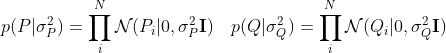

To give the negative-log-likelihood loss:

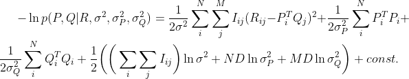

Crucially one can introduce (hyper)priors over the hyperparameters (`\sigma, \sigma_P, \sigma_Q`) and jointly optimize over the posterior, to give a form of automatic complexity control, without having to resort to hyperparameter tuning with a validation set.

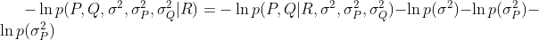

This feature is implemented in `reclibwh.core.PMF.AdaptiveRegulizer` and wraps a standard tensor, to add a regularization term with a tunable multiplier `lambda` after a re-parameterization (`lambda_p= 1/\sigma_p^2` and `lambda_q= 1/\sigma_q^2`)

```
    u_in = Input(shape=(1,), dtype='int32', name='u_in')

    P = Embedding(N, f, dtype='float32',
                    embeddings_regularizer=regularizers.l2(lamb) if not adaptive_reg else None, 
                    input_length=1,
                    embeddings_initializer='random_normal', name='P')
    p = P(u_in)

    LambdaP = AdaptiveRegularizer(N, Nranked, initial_value=-15., mult=0.01, name='lambda_p')
    rp2 = LambdaP(p)
```

Preliminary experiments with the movielens-100k dataset shows much better generalization v.s. an unregularized model. PMF denotes the model with adaptive regularization applied, and SVD denotes an unregularized model.

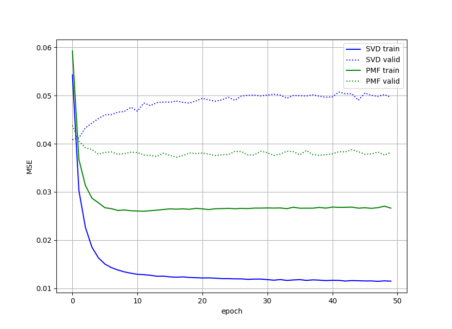

Plots of learned regularization parameters (log) `lambda_p` and `lambda_q`

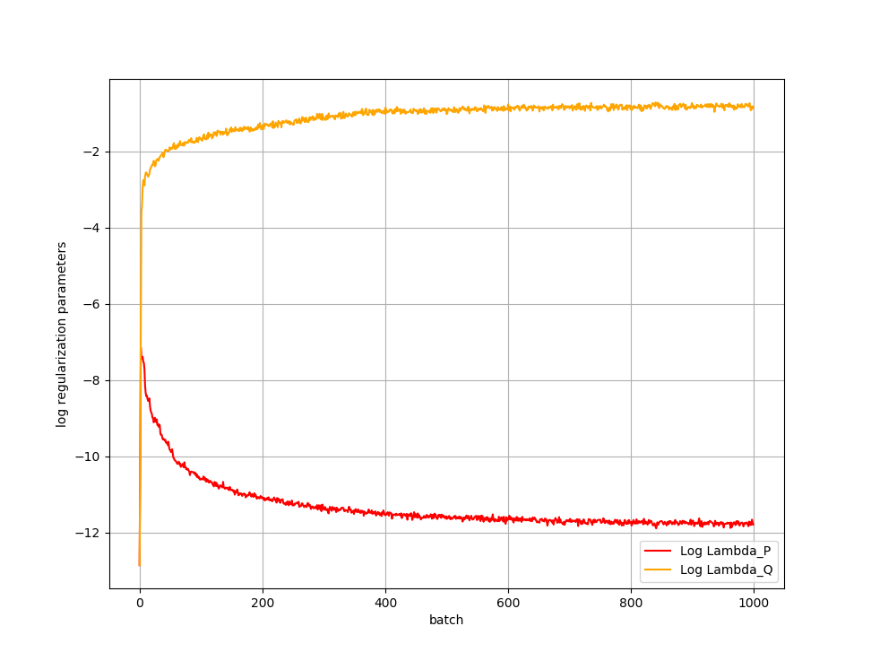


### Tensorflow implementation of Alternating Least Squares

A tensorflow implementation of the Alternatinf Least Squares algorithm for Implicit Matrix Factorization is implemented in 
`reclibwh.core.ALS`

And is used by `reclibwh.recommender.recommenderALS`. This implementation uses tensorflow to parallelize the massively parallel matrix operations over a GPU instead of having to call on massive computing clusters. The movielens dataset was trained in under 30 minutes on a GTX 1080Ti.

### Example Visualization

Visualization of Ego Graphs. A side effect of many of the recommendation algorithms used in this library is the ability to caluclate item-item similarity. This can be used to create and visualize relationship graphs between items using pairwise similarity. One such visualization is an ego graph, showing the relationships between items most closely related to a query item. Please check out `notebooks/ego_graph_viz.ipynb` for details on how these are created

Ego Graph centred around "The Godfather (I)", with a radius of 10.

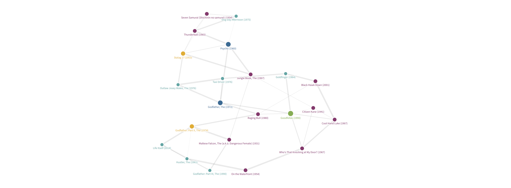

Ego Graph centred around "The Big Lebowski", with a radius of 15.

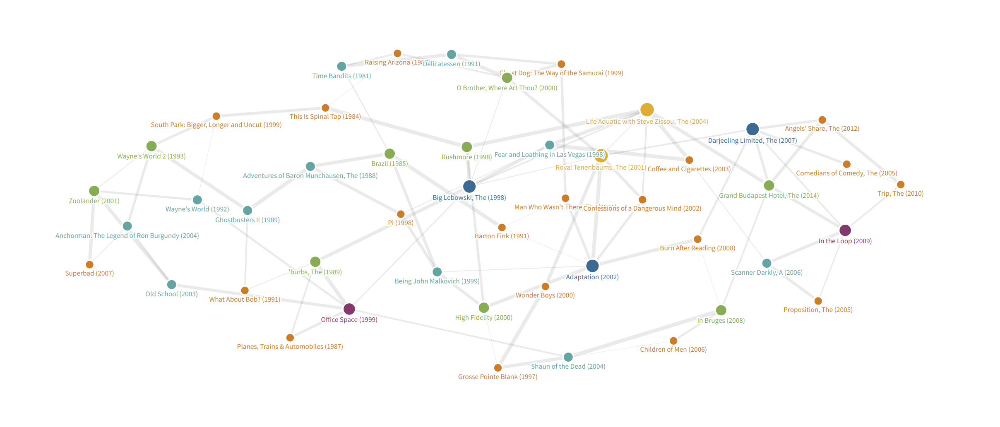

## Notes


### Combining Implicit and Explicit predictions

Using the notation given in https://dl.acm.org/doi/10.1145/963770.963774. An explicit model is interested in predicting an expected score `v` for an item `y` given a user `u`. The paper frames this problem as a latent factor model with a factor `z`:

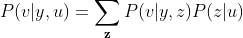
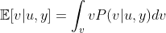

One way to use the implicit-ness with the explicit model is to sample items according to `P(y|u)`, and then rank the sampled items accordung to `E[v|u,y]`. Another way to combine the two would be to use the following ranking score:

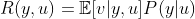

This way, those items that have a high implicit score `P(y|u)` and a high expected explicit score `E[v|u,y]` will be the highest in the recommendation list.

In the matrix factorization models, this can be done by simply multiplying the predictions from an implicit and explicit models.

### References
 TODO